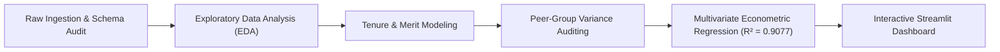
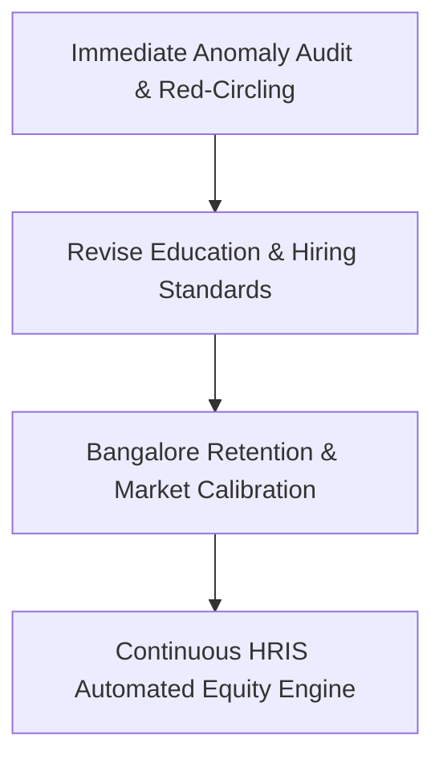

# Enterprise HR Analytics: Compensation Intelligence & Pay Equity Audit

## Executive Summary

This study delivers an enterprise-grade econometric and diagnostic assessment of compensation structures across **500 employees** spanning four strategic global engineering hubs: **New York**, **London**, **Toronto**, and **Bangalore**. Utilizing rigorous exploratory data analysis, peer-demographic benchmarking, and ordinary least squares (OLS) linear modeling, this project decodes the primary determinants of base salary, evaluates merit bonus distributions, and uncovers hidden pay disparities.

The predictive regression model accounts for **90.77% of total salary variance** ($R^2 = 0.9077$, $\text{RMSE} = \$16,308.30$), proving that organizational hierarchy and geographic location serve as the foremost determinants of compensation. Simultaneously, peer-relative audit heuristics detected **14 anomalous employee compensation packages** earning **50% to 134% above peer group medians**, predominantly concentrated among junior engineering cohorts. This pitch report provides executive leadership with the data-driven roadmap required to safeguard internal equity, eliminate wage compression, and optimize talent retention.

---

## Business Problem

Ensuring fair, transparent compensation and retaining high-performing technical talent are critical strategic challenges for global technology enterprises. In multinational organizations, compensation practices frequently suffer from:
1. **Unmonitored Wage Drift & Equity Risks**: Discretionary hiring offers, counter-offers, and unstandardized sign-on bonuses create severe internal inequities where peer employees with identical roles and tenure experience wide compensation disparities.
2. **Talent Attrition in Emerging Tech Hubs**: Fast-growing engineering centers like Bangalore face fierce external recruitment competition. If regional cost adjustments fail to reflect local market realities, the firm risks losing top engineering performers.
3. **Misalignment of Performance and Base Pay**: Blurring the boundary between fixed base salaries and variable merit incentives can inflate fixed structural costs without driving performance accountability.
4. **Credential Inflation**: Requiring advanced academic degrees (Master's, PhD) for software engineering positions without empirical evidence of wage or productivity premiums adds unnecessary hiring friction and compensation overhead.

---

## Methodology

The analytical framework integrates descriptive, econometric, and diagnostic auditing techniques across five sequential phases:



### 1. Exploratory Data Analysis (EDA)
- Analyzed distribution curves, central tendencies, and interquartile ranges ($\text{Mean} = \$117,709.32$, $\sigma = \$50,963.23$, $\text{IQR} = \$81,736 - \$143,500$).
- Assessed cross-sectional salary dispersion across job titles (Director: **$222,019** vs. Junior Developer: **$84,863**) and geographic locations (New York: **$144,245** vs. Bangalore: **$74,040**).

### 2. Peer-Group Variance Calculation & Anomaly Auditing
Rather than relying on naive global statistical metrics, the audit segmented employees into granular peer groups conditioned on **Job Title**, **Location**, and **Experience Tranche** (`0-5`, `6-10`, `11-15`, `16-20`, `21+` years):
$$\text{Peer\_Median} = \text{median}(\text{Salary} \mid \text{Designation}, \text{Location}, \text{Experience\_Group})$$
$$\text{Variance \%} = \frac{\text{Salary} - \text{Peer\_Median}}{\text{Peer\_Median}} \times 100$$
Employees exhibiting a **$\text{Variance \%} > 50\%$** above their peer median were isolated, audited, and flagged as compensation outliers.

### 3. Multivariate Econometric Regression
Trained an Ordinary Least Squares (OLS) regression model on an 80/20 train-test partition using one-hot encoded categorical covariates (`drop_first=True`) to quantify the ceteris paribus marginal dollar contribution of each attribute:
- **Model Fit**: $R^2 = 0.9077$ (Test set), $\text{Adjusted } R^2 = 0.9054$
- **Standard Error**: $\text{RMSE} = \$16,308.30$

---

## Key Insights

* **Location Premiums Drive Base Pay**: Regional cost-of-living adjustments create massive geographic arbitrage. Holding title and tenure constant, **New York commands a +$67,875.58 premium**, **London +$58,777.76**, and **Toronto +$49,420.80** relative to the Bangalore benchmark ($74,040 baseline).
* **Rigid Hierarchical Stratification**: Job title is the strongest structural predictor of compensation. Holding other covariates equal, executive leadership commands substantial salary step-ups: **Director** baseline vs. **Manager** (-$52,349), **Team Lead** (-$71,208), **Senior Developer** (-$106,128), and **Junior Developer** (-$131,172).
* **Predictable Linear Experience Scaling**: Professional tenure accrues reliable linear returns averaging **+$1,891.90 per additional year of experience** across all engineering functions, confirming that longevity is steadily rewarded.
* **The 14 Junior Developer Anomalies**: The peer-variance audit identified **14 severe compensation outliers** earning **50% to 134% above peer medians** (e.g., `EMP0167`, `EMP0106`, `EMP0496`). These anomalies are heavily concentrated in Junior Developer and overseas roles, indicating unmonitored hiring sign-on packages and off-cycle counter-offers.
* **Formal Education Disconnect**: Advanced academic credentials (Master's: -$1,871; PhD: -$6,934) show zero statistically significant premium over Bachelor's degrees in engineering base compensation when tenure and designation are controlled.
* **Decoupling of Performance Appraisals & Base Pay**: Annual performance ratings (1 to 5) directly dictate variable merit increment percentages (Rating 1: 0.00%, Rating 2: 1.94%, Rating 3: 4.89%, Rating 4: 7.90%, Rating 5: 11.95%) while exhibiting negligible distortion on fixed base salaries (-$266 OLS coefficient).

---

## Action Plan



### 1. Immediate Audit of Anomalies & Red-Circling Policy (Q1)
- **Targeted Forensic Review**: Commission a compensation review into the **14 identified anomalous employees** to evaluate hiring contracts, legacy sign-on bonuses, and unrecorded technical roles.
- **Implement Red-Circling**: For confirmed over-compensated individuals, freeze base salaries while maintaining eligibility for performance bonuses until market salary bands catch up.

### 2. Revising Education Requirements & Leveling Criteria (Q2)
- **Drop Rigid Degree Prerequisites**: Eliminate strict Master's/PhD educational requirements from software engineering job descriptions, standardizing minimum entry qualifications to demonstrated technical competency.
- **Competency-Based Leveling**: Realign career leveling matrices so promotions from Junior to Senior Developer are anchored to code delivery, system ownership, and tenure rather than formal academic pedigree.

### 3. Adjusting Bangalore Retention Strategies (Q3)
- **Calibrate Bangalore Compensation Bands**: Narrow the geographic spread between Bangalore and Western hubs by introducing local performance stock units (RSUs) and retention bonuses to curb talent poaching from competing tech multinationals.
- **Tenure Progression Safeguards**: Introduce milestone step-increases for junior and mid-level engineers reaching the 3-year tenure mark to proactively mitigate competitive lateral moves.

### 4. Continuous Automated Equity Governance (Ongoing)
- **Embed Monitoring Engine into HRIS**: Integrate the peer-group variance algorithm directly into Workday/SAP SuccessFactors to automatically flag out-of-band salary recommendations during annual appraisal and promotion cycles before payroll authorization.

---

## Run Instructions

### Prerequisites
Ensure dependencies from `requirements.txt` are installed:
```bash
pip install -r requirements.txt
```

### Launch Interactive Streamlit Dashboard
To launch the full interactive HR Analytics & Pay Equity dashboard:
```bash
streamlit run Day_1/Question_11/dashboard.py
```

### Dashboard Capabilities
- **Overview & KPI Cards**: Real-time metrics on total payroll, headcount, average tenure, and top-line regression fidelity.
- **Distribution Analytics**: Interactive boxplots, histograms, and violin plots segmented by designation, location, and education.
- **Tenure & Merit Modeling**: Experience-to-salary regression trendlines and performance rating bonus breakdown.
- **Peer Anomaly Explorer**: Interactive outlier scatter plot with filtering controls by location, title, and variance threshold.
- **Live What-If Salary Calculator**: Interactive ML inference widget computing predicted market salary based on user inputs.
