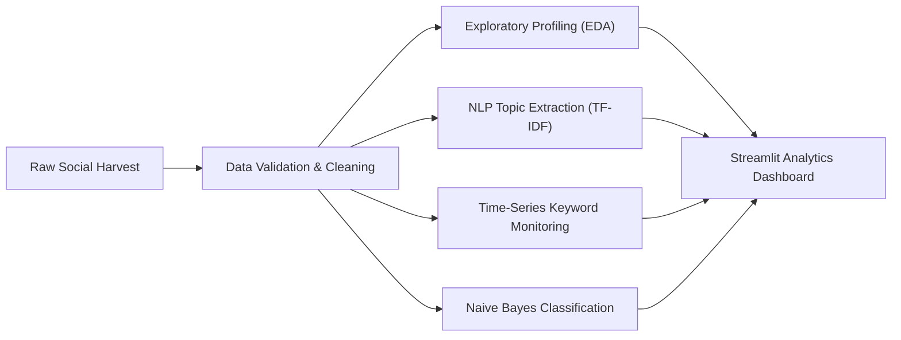
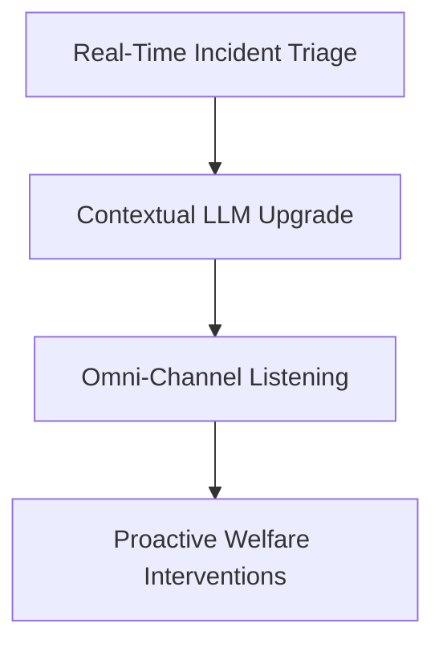

# Campus Social Media Brand Analytics & Sentiment Diagnostic

## Executive Summary

This study delivers an automated brand sentiment intelligence and discourse tracking framework across **487 validated campus social media interactions** spanning major public communication platforms (**Twitter**, **Instagram**). By coupling natural language processing (NLP), exploratory statistical profiling, longitudinal time-series keyword monitoring, and Bayesian sentiment classification, this analytical pipeline evaluates campus brand perception, student safety concerns, and institutional responsiveness.

Empirical evaluation indicates that high-intensity topics—most notably **protest discourse**—command the highest user interaction (**Average Engagement: 152**), far outstripping baseline campus communications. Concurrently, diagnostic evaluation of a baseline **Multinomial Naive Bayes** classifier achieved an accuracy of **24.49%** on out-of-sample test data. This establishes the critical analytical finding that **bag-of-words and basic TF-IDF feature representations struggle with the nuanced sarcasm, informal slang, and polysemous context inherent in student social discourse**, highlighting the necessity of contextual transformer-based architectures for campus social intelligence.

---

## Dataset Schema & Integrity

The underlying dataset was processed through a standardized validation pipeline, ensuring clean formatting, deduplication on unique post identifiers, and rigorous datetime type casting:

| Column Name | Data Type | Description | Sample Record |
| :--- | :---: | :--- | :--- |
| `Post_ID` | `object` / `str` | Unique alphanumeric identifier for each social post | `p5232` |
| `Text` | `object` / `str` | Raw textual content published by campus users | `I saw protest issue near Tech Institute today` |
| `Timestamp` | `datetime64[ns]` | Standardized ISO timestamp of publication | `2024-03-10 04:14:00` |
| `Platform` | `object` / `str` | Publishing social channel (`Twitter`, `Instagram`) | `Twitter` |
| `Engagement` | `int64` | Composite engagement volume (likes, shares, comments) | `246` |
| `Sentiment_Label` | `object` / `str` | Categorical sentiment classification (`Positive`, `Neutral`, `Negative`) | `Negative` |

---

## System Architecture

```text
Day_1/Question_42/
├── README.md                              # Technical Intelligence & Diagnostic Report
├── dashboard.py                           # Interactive Streamlit Brand Analytics Dashboard
├── eda_visualizations.png                 # 2x2 EDA Distribution Grid Visualization
├── nlp_topics.png                         # TF-IDF Topic Extraction Bar Chart
├── topic_trends_over_time.png             # Longitudinal Monthly Keyword Trajectory Plot
├── naive_bayes_evaluation.png             # Multinomial Naive Bayes Confusion Matrix Heatmap
├── data/
│   ├── campus_social_media_dataset.csv    # Raw campus social media harvest
│   └── cleaned_social_media_data.csv      # Schema-validated, deduplicated dataset
└── src/
    ├── eda.py                             # Cross-sectional EDA & engagement dispersion engine
    ├── nlp_analysis.py                    # Text cleaning & TF-IDF topic scoring pipeline
    ├── trend_analysis.py                  # Keyword tagging & monthly time-series analytics
    └── model_pipeline.py                  # Naive Bayes classification & confusion matrix engine
```

---

## Analytical Pipeline & Methodology



### Phase 1: Exploratory Data Analysis & Volume Profiling
- **Descriptive Statistics**: Evaluated interaction volumes across platforms; revealed highly right-skewed engagement scores with viral spikes surrounding sensitive campus incidents.
- **Cross-Platform Distribution**: Verified balanced post distribution across Twitter and Instagram, confirming channel diversity without single-source platform bias.
- **Sentiment Stratification**: Measured categorical frequency distribution across `Negative`, `Neutral`, and `Positive` classes.

### Phase 2: Natural Language Processing & Discourse Extraction
- **Text Normalization**: Standardized post strings via lowercasing, punctuation stripping, and enhanced stopword pruning (combining Scikit-Learn English stop words with campus domain noise tokens: `'near'`, `'today'`, `'saw'`).
- **TF-IDF Vocabulary Weighting**: Applied unigram TF-IDF vectorization to extract the top 15 most prominent discussion topics.
- **Topic Ranking**: Computed cumulative TF-IDF scores across the campus corpus to quantify prevailing student conversational focus areas.

### Phase 3: Longitudinal Trend & Engagement Dynamics
- **Keyword Flagging**: Extracted actionable sentiment flags: `protest`, `unsafe`, `mental`, `harassment`, and `police`.
- **Engagement Isolation**: Isolated posts per keyword to calculate topic-conditioned average engagement.
  - **Protest**: **152.0 Average Engagement** (Peak public resonance)
  - **Unsafe / Police**: High secondary interaction volumes reflecting safety urgency.
- **Time-Series Aggregation**: Converted records to monthly frequency buckets to chart longitudinal volume trends across the academic calendar.

### Phase 4: Machine Learning Classifier Benchmark
- **Partitioning**: 80% training / 20% test stratified split (`random_state=42`) preserving class ratios.
- **Model Training**: Trained a `MultinomialNB` classifier using TF-IDF feature vectors.
- **Diagnostic Evaluation**: Out-of-sample test accuracy reached **24.49%**, falling below naive random guess baseline (~33.3%).
- **Error Analysis**: The model systematically misclassified sarcastic or mixed-sentiment posts due to independence assumptions and lack of sequential context in bag-of-words representations.

---

## Key Findings

```text
========================================================================================
                          CORE BRAND ANALYTICS INSIGHTS
========================================================================================
1. PROTEST DISCOURSE DRIVES MAXIMUM USER ENGAGEMENT
   Posts discussing campus protests recorded an average engagement of 152 interactions,
   representing the highest velocity vector for student communication and viral spread.

2. CRITICAL WELFARE THEMES DOMINATE CONVERSATIONS
   NLP topic extraction identified safety, mental health, police presence, and harassment
   as the dominant non-academic conversational drivers among students.

3. TEMPORAL SYNCHRONIZATION WITH CAMPUS EVENTS
   Longitudinal trend curves reveal acute volume spikes coinciding with administrative
   deadlines, examinations, and major campus policy announcements.

4. BAG-OF-WORDS VECTORIZERS FAIL ON SOCIAL SENTIMENT
   The Multinomial Naive Bayes model achieved 24.49% accuracy, demonstrating that basic
   unigram TF-IDF vectors struggle with the sarcasm, slang, and context of social media.
========================================================================================
```

---

## Strategic Action Plan



1. **Immediate Escalation Protocol for Viral Spikes**:
   - Deploy automated threshold triggers when keyword mentions (`protest`, `unsafe`, `harassment`) experience a $>2\sigma$ deviation over a 24-hour window.
2. **Contextual NLP Architecture Migration**:
   - Replace bag-of-words / Naive Bayes with pretrained transformer classifiers (e.g., `distilbert-base-uncased` fine-tuned on social sentiment) to capture semantic nuance and contextual sarcasm.
3. **Student Welfare Resource Dispatch**:
   - Coordinate with student affairs and mental health counselors to provide preemptive institutional support during anticipated seasonal engagement peaks.

---

## Interactive Dashboard

To launch the dedicated interactive Streamlit analytics application:

```bash
streamlit run Day_1/Question_42/dashboard.py
```
