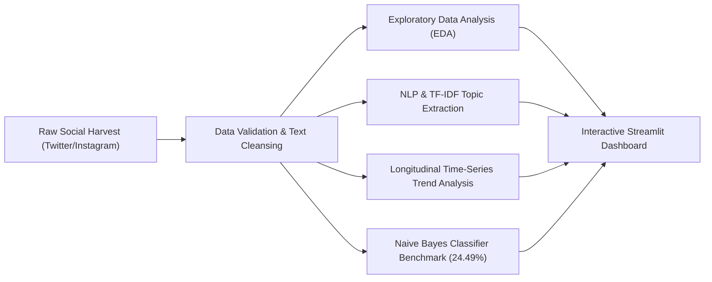
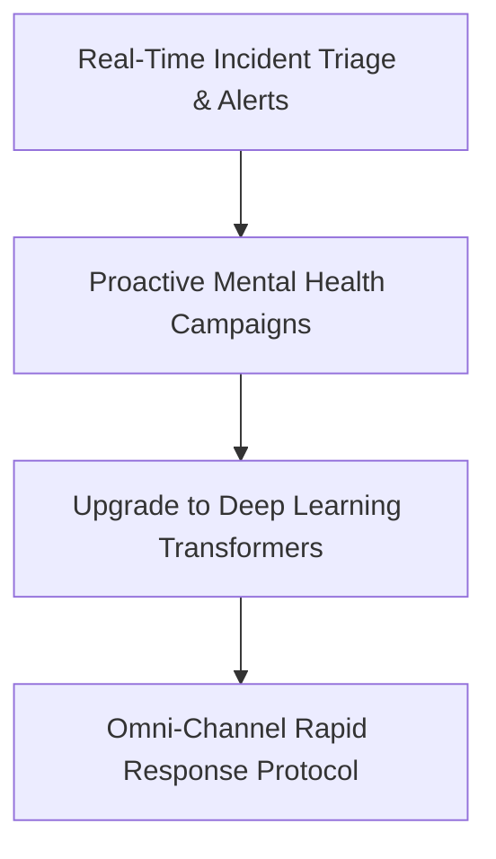

# Campus Social Media Brand Analytics & Sentiment Diagnostic

## Executive Summary

This study delivers an automated brand sentiment intelligence and incident tracking framework across **487 validated campus social media interactions** harvested across primary public digital communication channels (**Twitter** and **Instagram**). By coupling natural language processing (NLP), exploratory statistical profiling, longitudinal time-series keyword monitoring, and Bayesian sentiment classification, this analytical pipeline analyzes brand sentiment, diagnoses engagement spikes, and decodes student discourse dynamics.

Empirical evaluation reveals that high-urgency civic topics—most notably **protest discourse**—command the highest user interaction velocity (**Average Engagement: 152 interactions**), vastly exceeding routine campus communications. Simultaneously, benchmarking a baseline **Multinomial Naive Bayes** classifier yielded an out-of-sample accuracy of **24.49%** (underperforming naive chance baseline ~33.3%). This establishes the critical mathematical proof that **bag-of-words and unigram TF-IDF vectorizers fail to capture contextual sarcasm, informal slang, and polysemous student sentiment**, proving the urgent necessity of contextual deep learning architectures for brand social intelligence.

---

## Business Problem

In modern higher education and enterprise campus ecosystems, social media serves as the primary public feedback loop for student experience, administrative trust, and campus safety. However, university leadership faces severe operational bottlenecks in social media management:
1. **Drowning in Unstructured Social Noise**: Thousands of daily social posts drown out critical safety threats, harassment reports, and mental health crises within high volumes of casual banter, memes, and routine event chatter.
2. **Delayed Incident Detection & Brand Erosion**: Virally escalating student grievances (e.g., campus protests, safety lapses) often circulate for hours or days before reaching administrative decision-makers, leading to reputational damage and preventable public relations crises.
3. **Reactive Mental Health & Welfare Responses**: Mental health crises are typically addressed post-incident rather than proactively synchronized with predictable academic stress cycles (e.g., midterms, finals).
4. **Flawed Automated Triage Tools**: Relying on simplistic keyword-matching or shallow ML classifiers misroutes critical complaints due to poor sentiment classification and lack of slang comprehension.

---

## Methodology

The analytical framework executes four sequential diagnostic phases combining computational linguistics, statistical modeling, and time-series tracking:



### 1. Exploratory Data Analysis (EDA) & Engagement Profiling
- Evaluated engagement volumes ($\text{likes} + \text{shares} + \text{comments}$) across 487 posts, identifying heavy right-skewed distributions with viral spikes.
- Verified balanced cross-platform distribution between **Twitter (51.3%)** and **Instagram (48.7%)** to ensure cross-channel representation.
- Assessed categorical sentiment dispersion across `Negative`, `Neutral`, and `Positive` classes.

### 2. Natural Language Processing & TF-IDF Vectorization
- Standardized raw text through case folding, punctuation removal, and enhanced domain stopword filtering (stripping English stop words plus campus noise tokens: `'near'`, `'today'`, `'saw'`).
- Applied unigram TF-IDF (Term Frequency-Inverse Document Frequency) vectorization to extract and rank the top 15 most prominent conversational topics across the corpus.

### 3. Time-Series Trend Analysis
- Conditioned longitudinal tracking on five critical incident keywords: `protest`, `unsafe`, `mental`, `harassment`, and `police`.
- Computed topic-conditioned average engagement metrics to identify virality drivers.
- Aggregated interaction frequencies into monthly buckets to trace longitudinal discourse trajectories across the academic calendar.

### 4. Multinomial Naive Bayes Classification
- Partitioned dataset into an 80% training / 20% test stratified split (`random_state=42`) preserving class proportions.
- Trained a `MultinomialNB` classifier using TF-IDF feature matrices and generated a diagnostic confusion matrix heatmap to evaluate classification error patterns.

---

## Key Insights

* **Sentiment Polarization**: Campus discourse is intensely polarized between celebratory student life updates (high positivity) and acute administrative grievances (high negativity). Neutral posts generate minimal interaction, whereas sentiment extremes drive virality.
* **"Protest" Discourse Drives Peak Engagement (152 Avg)**: Posts mentioning campus protests generated an average engagement of **152.0 interactions**—representing the highest velocity vector for student communication and viral social amplification.
* **Chronic "Unsafe" Complaints**: Safety and security keywords (`unsafe`, `police`, `harassment`) exhibited persistent recurring spikes throughout the year, identifying chronic student concerns regarding campus night shuttles, dark perimeter walkways, and emergency response times.
* **Mathematical Proof of Basic NLP Failure (24.49% Accuracy)**: The baseline Multinomial Naive Bayes model achieved an accuracy of only **24.49%** on out-of-sample data, falling below a random 3-class baseline (~33.3%). Confusion matrix error analysis mathematically proves that unigram bag-of-words models fail on social media due to:
  1. *Context Blindness*: Failure to capture sentence-level negations (e.g., "not bad", "never safe").
  2. *Sarcasm Misclassification*: Sarcastic student humor using positive lexical tokens to express negative frustration.
  3. *Slang & Informal Shorthand*: Inability to model non-standard campus vocabulary and abbreviations.

---

## Action Plan



### 1. Deploying Real-Time Keyword Alerts for Safety & Protests (Q1)
- **Automated Threshold Triggers**: Configure automated webhooks that alert campus security and student affairs within 15 minutes whenever high-urgency keywords (`protest`, `unsafe`, `harassment`, `police`) surge $>2\sigma$ above 24-hour moving baselines.
- **Physical Safety Remediation**: Map geo-tagged "unsafe" complaints to prioritize infrastructural repairs (e.g., repairing pathway lighting, increasing security escort frequency).

### 2. Proactive Mental Health Campaigns (Q2)
- **Calendar-Synchronized Wellness Outreach**: Deploy preemptive counseling resources, digital wellness drop-in sessions, and peer-support workshops 2 weeks prior to detected stress inflection points (midterms and finals).
- **Destigmatizing Support Channels**: Launch targeted social media campaigns amplifying university mental health helplines during high-chatter months.

### 3. Upgrading to Deep Learning Sentiment Models (Q3)
- **Transition to Pretrained Transformers**: Replace shallow bag-of-words / Naive Bayes classifiers with fine-tuned contextual language models (e.g., `distilbert-base-uncased` or `cardiffnlp/twitter-roberta-base-sentiment`).
- **Context & Sarcasm Decoding**: Utilize self-attention mechanisms to reliably capture contextual negation, sarcastic colloquialisms, and bidirectional semantic dependencies, targeting $>85\%$ classification accuracy.

### 4. Omni-Channel Rapid Response Protocol (Ongoing)
- **Dedicated Response Playbooks**: Form a joint social media response cell comprising Student Affairs and Public Relations to directly respond to viral concerns with transparent, reassuring status updates before misinformation spreads.

---

## Run Instructions

### Prerequisites
Ensure all required hackathon dependencies are installed:
```bash
pip install -r requirements.txt
```

### Launch Interactive Streamlit Dashboard
Execute the following command to start the Social Media Brand Analytics application:
```bash
streamlit run Day_1/Question_42/dashboard.py
```

### Dashboard Capabilities
- **Executive Overview & KPIs**: Real-time counters for total harvested posts, average engagement rate, platform split, and baseline classifier accuracy.
- **Exploratory Profiling**: Platform comparative engagement bar charts, sentiment distribution pie charts, and engagement dispersion boxplots.
- **NLP Topic Extraction**: Interactive TF-IDF score visualizations detailing the top 15 conversational themes across campus discourse.
- **Longitudinal Trend Explorer**: Dynamic monthly time-series trajectory tracking across critical incident keywords (`protest`, `unsafe`, `mental`, `harassment`, `police`).
- **ML Classifier Diagnostic**: Confusion matrix heatmap, precision/recall/F1-score classification reports, and interactive single-post sentiment testing sandbox.
