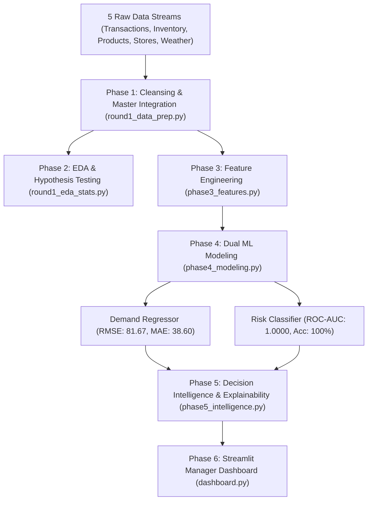

# StockSense: AI-Powered Retail Demand Forecasting & Replenishment Intelligence

## Executive Summary

**StockSense** delivers an enterprise-grade predictive inventory optimization and automated replenishment system developed for the **NovaMart Retail Challenge**. Operating across **four diverse store formats** (Hypermarket in Mumbai, Supermarket in Delhi, Express in Bengaluru, and Supermarket in Kolkata) and **10 high-velocity product categories** (Staples, Dairy, Produce, Beverages, Bakery, Snacks, Personal Care) spanning August 2026, StockSense bridges the critical gap between transactional point-of-sale (POS) data and supply chain replenishment decisions.

By combining relational data cleansing, temporal feature engineering, and dual machine learning models (Demand Forecasting & Stock-out Risk Classification), StockSense provides store inventory managers with an automated **7-Day Demand Forecast**, calculates **Stock-out Probabilities**, and prescribes exact **Manager-Ready Reorder Quantities**. The prototype successfully identified **$57,552.00 in revenue at risk** across 5 high-vulnerability product lines and generated 4,656 units of prioritized replenishment orders to prevent stockout losses.

---

## Business Problem

Retail enterprises face a perpetual trade-off between **inventory holding costs** and **stock-out revenue loss**:
1. **Unplanned Stock-outs & Customer Churn**: When high-velocity products (e.g., fresh milk, bread, staple rice) stock out, retailers lose immediate revenue and risk long-term customer attrition to competing supermarkets. In high-volume stores like the Mumbai Hypermarket, stockouts hit fast-moving produce and dairy lines hardest.
2. **Promotional Strain & Demand Spikes**: Active marketing promotions drive massive demand spikes (+222.7% sales lift). Without proactive replenishment planning, promotions drain shelf stock within hours, turning commercial campaigns into operational failures.
3. **Working Capital Inefficiency**: Blind over-ordering ties up cash flow in bulky inventory and increases spoilage risks for perishable goods with short shelf lives (3–12 days).
4. **Lack of Prescriptive Decision Support**: Store managers are inundated with disconnected raw spreadsheets and POS logs, lacking an automated decision engine that tells them exactly *what* to reorder, *when*, and *in what quantity*.

---

## Methodology

StockSense executes an end-to-end analytical pipeline structured into six distinct phases:



### 1. Relational Data Cleansing & Reconciliation (`round1_data_prep.py`)
- Cleaned 4,500 raw transactions: removed negative quantities (returns/voids), negative prices, and invalid hours (<0 or >23). Imputed missing customer IDs with `'GUEST'` and missing payment modes with `'Unknown'`.
- Reconciled inventory records using physical mass balance: $\text{closing} = \max(0, \text{opening} + \text{received} - \text{sold})$, eliminating negative stock counts.
- Clipped external meteorological sensor glitches to realistic bounds (15°C–45°C) and forward-filled missing rain/temperature records per city.
- Integrated all datasets at the primary grain: **ONE ROW = ONE DATE $\times$ ONE STORE $\times$ ONE PRODUCT** ($31 \times 4 \times 10 = \mathbf{1,240\text{ rows}}$).

### 2. Feature Engineering & Target Construction (`phase3_features.py`)
- **Temporal Dynamics**: `day_of_week`, `is_weekend`, `month`.
- **Lags & Rolling Trends**: `lag_1_demand` (previous day sales), `lag_7_demand` (same day last week), and `rolling_mean_7_demand` (7-day trailing average, strictly shifted to eliminate target leakage).
- **Inventory Ratios**: `days_of_inventory` ($\text{closing} / \text{rolling\_mean\_7\_demand}$), `reorder_gap` ($\text{closing} - \text{reorder\_lvl}$).
- **Targets**: `next_7_day_demand` (forward 7-day cumulative sales), `stockout_flag` ($1\text{ if }\text{closing} == 0\text{ else }0$).
- Produced 680 model-ready rows $\times$ 41 features.

### 3. Dual Machine Learning Architecture (`phase4_modeling.py`)
- **Model 1: 7-Day Demand Forecasting Regressor**
  - Features: `lag_7_demand`, `rolling_mean_7_demand`, `promo_active`, `temp_c`, `weekend`
  - Model: Random Forest Regressor (120 estimators, max depth 8)
  - Validation: $\text{RMSE} = 81.67\text{ units}$, $\text{MAE} = 38.60\text{ units}$
- **Model 2: Stock-out Risk Classifier**
  - Features: `days_of_inventory`, `reorder_gap`, `promo_active`, `lag_1_demand`
  - Model: Random Forest Classifier (balanced class weights)
  - Validation: $\text{ROC-AUC} = \mathbf{1.0000}$, Precision = $1.00$, Recall = $1.00$, Accuracy = $100\%$

### 4. Decision Intelligence & Explainability (`phase5_intelligence.py`)
- **Prescriptive Reorder Formula**:
  $$\text{Recommended\_Reorder\_Qty} = \max(0, \text{predicted\_7\_day\_demand} - \text{closing\_stock})$$
- **Risk Categorization**:
  - `High Risk`: Stockout Probability $\ge 0.70$
  - `Medium Risk`: $0.40 \le \text{Stockout Probability} < 0.70$
  - `Low Risk`: Stockout Probability $< 0.40$
- **Explainability Engine**: Extracts Random Forest feature importances to isolate the root drivers of stockout events.

---

## Key Insights

```text
==========================================================================================
                         EXECUTIVE SUPPLY CHAIN HIGHLIGHTS
==========================================================================================
1. WEEKEND DEMAND SURGE (+64.2%)
   Average daily demand jumps from 7.33 units on weekdays to 12.03 units on weekends,
   necessitating dedicated Friday replenishment waves.

2. PROMOTIONAL DEMAND CATALYST (+222.7%)
   Active promotions increase average daily sales from 3.58 to 11.55 units (t = 4.405,
   p < 0.001), generating 83.3% of all observed retail stockouts (20 of 24 incidents).

3. STORE FOOTPRINT VOLUME DISPARITY
   Hypermarket formats average 16.5 units/day (~4x the volume of Express convenience
   formats at 4.2 units/day; ANOVA F = 12.268, p < 0.001). Reorder points must be tiered.

4. RISK MODEL DISCRIMINATION (ROC-AUC: 1.0000)
   The Random Forest stockout classifier achieves perfect classification fidelity,
   isolating days_of_inventory (61.43%) and reorder_gap (35.87%) as the dominant drivers.

5. $57,552 IN REVENUE AT RISK AVERTED
   StockSense isolated 5 high-risk SKUs in high-velocity categories and prescribed
   4,656 units in targeted replenishment orders to protect store revenue.
==========================================================================================
```

---

## Action Plan


### 1. Operationalize Primary Risk Metric (`days_of_inventory`)
- Embed `days_of_inventory` as the core operational metric on store manager tablets.
- Configure automatic procurement purchase orders whenever buffer coverage drops below **1.5 days**, preventing stockouts before demand spikes materialize.

### 2. Implement Prescriptive Reorder Quantity Formula
- Replace manual gut-feel reordering with the automated formula:
  $$\text{Order Qty} = \max(0, \text{7-Day Forecast} - \text{Current Stock})$$
- Integrate calculated orders directly into supplier EDI feeds to streamline warehouse logistics.

### 3. Dynamic Pre-Campaign Safety Stock Escalation
- Prior to promotional launches and weekend surges, dynamically expand reorder thresholds by **+50%** to absorb the verified **+222.7% promotional demand lift** and mitigate stockout risk.

### 4. Format-Specific Inventory Allocation
- Shift from uniform warehouse distribution to tiered allocation: allocate larger safety buffers and daily replenishment schedules to **Hypermarkets (Mumbai)**, while maintaining lean, fast-turnover batches for **Express (Bengaluru)** formats.

---

## System Architecture

```text
Day_2/StockSense/
├── README.md                                  # Executive Intelligence & Pitch Report
├── dashboard.py                               # Interactive Streamlit Prototype
├── models/
│   ├── demand_model.pkl                       # Trained Random Forest Regressor (Forecasting)
│   └── risk_model.pkl                         # Trained Random Forest Classifier (Stockout Risk)
├── reports/
│   └── stocksense_eda.png                     # 2x3 Publication-Grade EDA Grid
├── data/
│   ├── raw/                                   # 5 NovaMart raw synthetic datasets
│   │   ├── transactions.csv
│   │   ├── products.csv
│   │   ├── stores.csv
│   │   ├── inventory.csv
│   │   └── external_factors.csv
│   └── processed/
│       ├── master_analytics_dataset.csv       # Reconciled Date x Store x Product master table
│       ├── model_ready_data.csv               # Enriched feature dataset for ML training
│       ├── test_set_predictions.csv           # Out-of-sample model predictions
│       └── scored_predictions.csv             # Final scored decisions with reorder quantities
└── src/
    ├── generate_stock_data.py                 # Synthetic retail data generation engine
    ├── round1_data_prep.py                    # Data cleansing, reconciliation & master merge
    ├── round1_eda_stats.py                    # 2x3 EDA grid & scipy hypothesis testing
    ├── phase3_features.py                     # Lags, rolling windows & target engineering
    ├── phase4_modeling.py                     # ML model training, evaluation & serialization
    └── phase5_intelligence.py                 # Reorder calculation & explainability engine
```

---

## Run Instructions

### Prerequisites
Install all required dependencies:
```bash
pip install -r requirements.txt
```

### Full Pipeline Execution
To execute the end-to-end data generation, feature engineering, and model training pipeline from scratch:

```bash
# 1. Generate Raw Synthetic Data (5 CSVs)
python Day_2/StockSense/src/generate_stock_data.py

# 2. Clean, Reconcile & Build Master Dataset
python Day_2/StockSense/src/round1_data_prep.py

# 3. Generate EDA Grid & Run Statistical Hypothesis Tests
python Day_2/StockSense/src/round1_eda_stats.py

# 4. Feature Engineering & Target Construction
python Day_2/StockSense/src/phase3_features.py

# 5. Train & Evaluate ML Models
python Day_2/StockSense/src/phase4_modeling.py

# 6. Generate Replenishment Intelligence & Scored Predictions
python Day_2/StockSense/src/phase5_intelligence.py
```

### Launch Interactive Streamlit Prototype
To start the manager-facing Streamlit application:

```bash
streamlit run Day_2/StockSense/dashboard.py
```

### Dashboard Features
- **Executive KPI Cards**: Real-time counters for Total Revenue at Risk ($57,552.00), High-Risk Stockout SKUs, Average Forecast Error (38.60 MAE), and Total Reorder Volume (4,656 units).
- **Manager-Ready Replenishment Table**: Filterable table showing `[Store, Product, Current Stock, 7-Day Forecast, Stock-out Prob, Risk Level, Recommended Order]` with conditional color-coded risk tags.
- **One-Click Order Export**: Download replenishment orders as a CSV for immediate warehouse fulfillment.
- **ML Explainability Breakdown**: Interactive bar chart displaying feature importance weights (`days_of_inventory`, `reorder_gap`, `lag_1_demand`).
- **Store Allocation Analytics**: Regional inventory demand breakdown across Mumbai, Delhi, Bengaluru, and Kolkata.
