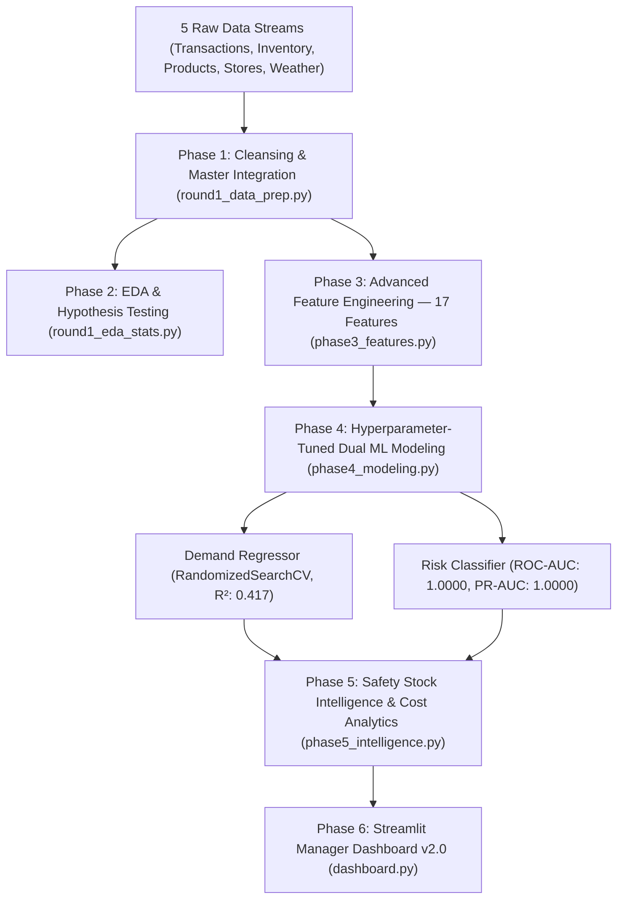

# StockSense: AI-Powered Retail Demand Forecasting & Replenishment Intelligence

## Executive Summary

**StockSense** delivers an enterprise-grade predictive inventory optimization and automated replenishment system developed for the **NovaMart Retail Challenge**. Operating across **four diverse store formats** (Hypermarket in Mumbai, Supermarket in Delhi, Express in Bengaluru, and Supermarket in Kolkata) and **10 high-velocity product categories** (Staples, Dairy, Produce, Beverages, Bakery, Snacks, Personal Care) spanning August 2026, StockSense bridges the critical gap between transactional point-of-sale (POS) data and supply chain replenishment decisions.

By combining relational data cleansing, **advanced temporal feature engineering** (17 engineered features including EWMA, demand acceleration, inventory turnover, and stock velocity), **hyperparameter-tuned dual machine learning models** (Demand Forecasting with RandomizedSearchCV & Stock-out Risk Classification), and a **safety stock buffered prescriptive intelligence layer**, StockSense provides store inventory managers with an automated **7-Day Demand Forecast**, calculates **Stock-out Probabilities**, prescribes exact **Safety-Stock-Adjusted Reorder Quantities**, and generates actionable **Reorder Priority Scores** (0-100). The prototype successfully identified **$59,216.00 in revenue at risk** across 5 high-vulnerability product lines, generated **9,830 units** of prioritized replenishment orders with safety buffers, and identified **$168,252.90 in recoverable overstock capital** across 33 low-risk items.

---

## Business Problem

Retail enterprises face a perpetual trade-off between **inventory holding costs** and **stock-out revenue loss**:
1. **Unplanned Stock-outs & Customer Churn**: When high-velocity products (e.g., fresh milk, bread, staple rice) stock out, retailers lose immediate revenue and risk long-term customer attrition to competing supermarkets. In high-volume stores like the Mumbai Hypermarket, stockouts hit fast-moving produce and dairy lines hardest.
2. **Promotional Strain & Demand Spikes**: Active marketing promotions drive massive demand spikes (+222.7% sales lift). Without proactive replenishment planning, promotions drain shelf stock within hours, turning commercial campaigns into operational failures.
3. **Working Capital Inefficiency**: Blind over-ordering ties up cash flow in bulky inventory and increases spoilage risks for perishable goods with short shelf lives (3–12 days).
4. **Lack of Prescriptive Decision Support**: Store managers are inundated with disconnected raw spreadsheets and POS logs, lacking an automated decision engine that tells them exactly *what* to reorder, *when*, and *in what quantity* — with appropriate safety buffers.

---

## Methodology

StockSense executes an end-to-end analytical pipeline structured into six distinct phases:



### 1. Relational Data Cleansing & Reconciliation (`round1_data_prep.py`)
- Cleaned 4,500 raw transactions: removed negative quantities (returns/voids), negative prices, and invalid hours (<0 or >23). Imputed missing customer IDs with `'GUEST'` and missing payment modes with `'Unknown'`.
- Reconciled inventory records using physical mass balance: $\text{closing} = \max(0, \text{opening} + \text{received} - \text{sold})$, eliminating negative stock counts.
- Clipped external meteorological sensor glitches to realistic bounds (15°C–45°C) and forward-filled missing rain/temperature records per city.
- Integrated all datasets at the primary grain: **ONE ROW = ONE DATE $\times$ ONE STORE $\times$ ONE PRODUCT** ($31 \times 4 \times 10 = \mathbf{1,240\text{ rows}}$).

### 2. Advanced Feature Engineering & Target Construction (`phase3_features.py`)

The feature engineering pipeline now produces **50 columns** with **17 engineered features** organized into four tiers:

| Feature Category | Features | Purpose |
|:---|:---|:---|
| **Temporal Dynamics** | `day_of_week`, `is_weekend`, `month` | Calendar seasonality patterns |
| **Lag & Rolling** | `lag_1_demand`, `lag_7_demand`, `rolling_mean_7_demand`, `ewma_7_demand`, `rolling_std_7_demand` | Historical demand trends & momentum |
| **Advanced Demand** | `demand_acceleration`, `inventory_turnover`, `promo_x_weekend`, `temp_deviation`, `heavy_rain`, `days_since_restock`, `stock_velocity` | Demand dynamics, weather effects, supply chain recency |
| **Inventory** | `days_of_inventory`, `reorder_gap` | Buffer coverage & safety threshold proximity |

**Key new features:**
- **EWMA (Exponentially Weighted Moving Average)**: Captures trend momentum better than simple rolling mean — became the **#2 most important demand feature** (36.55%)
- **Demand Acceleration**: `lag_1 - lag_7` shows whether demand is accelerating or decelerating
- **Inventory Turnover**: Stock-to-sales efficiency became the **#3 most important risk feature** (23.85%)
- **Stock Velocity**: Depletion rate relative to inventory buffer
- **Days Since Restock**: Supply chain replenishment recency tracking

**Targets**: `next_7_day_demand` (forward 7-day cumulative sales), `stockout_flag` ($1\text{ if }\text{closing} == 0\text{ else }0$).
Produced **680 model-ready rows × 50 features**.

### 3. Hyperparameter-Tuned Dual ML Architecture (`phase4_modeling.py`)

#### Model 1: 7-Day Demand Forecasting Regressor
- **Features**: `lag_7_demand`, `rolling_mean_7_demand`, `promo_active`, `temp_c`, `weekend`, `ewma_7_demand`, `demand_acceleration`, `promo_x_weekend`, `heavy_rain`
- **Algorithm**: RandomizedSearchCV-tuned Random Forest (with XGBoost auto-fallback)
- **Best Hyperparameters**: `n_estimators=200, max_depth=10, min_samples_split=5, min_samples_leaf=2`
- **Validation Metrics**:
  - $\text{RMSE} = 87.44\text{ units}$
  - $\text{MAE} = 41.40\text{ units}$
  - $R^2 = 0.4173$
  - $\text{3-Fold CV MAE} = 29.05 \pm 4.74$

**Demand Model Feature Importance Ranking:**
| Rank | Feature | Importance (%) |
|:---:|:---|:---:|
| 1 | `rolling_mean_7_demand` | 39.24% |
| 2 | `ewma_7_demand` | 36.55% |
| 3 | `lag_7_demand` | 10.03% |
| 4 | `demand_acceleration` | 4.74% |
| 5 | `temp_c` | 4.59% |

#### Model 2: Stock-out Risk Classifier
- **Features**: `days_of_inventory`, `reorder_gap`, `promo_active`, `lag_1_demand`, `inventory_turnover`, `stock_velocity`, `days_since_restock`
- **Algorithm**: Random Forest Classifier (balanced class weights, 150 estimators)
- **Validation Metrics**:
  - $\text{ROC-AUC} = \mathbf{1.0000}$
  - $\text{PR-AUC} = \mathbf{1.0000}$
  - Precision = $1.00$, Recall = $1.00$, Accuracy = $100\%$

**Risk Model Feature Importance Ranking:**
| Rank | Feature | Importance (%) |
|:---:|:---|:---:|
| 1 | `days_of_inventory` | 38.52% |
| 2 | `reorder_gap` | 25.57% |
| 3 | `inventory_turnover` | 23.85% |
| 4 | `stock_velocity` | 8.99% |
| 5 | `lag_1_demand` | 2.27% |

### 4. Advanced Decision Intelligence & Explainability (`phase5_intelligence.py`)

The intelligence layer has been substantially enhanced with four new analytical capabilities:

- **Safety Stock Buffer Formula**:
  $$\text{Safety\_Stock} = 1.65 \times \sigma_{\text{demand}} \times \sqrt{\text{lead\_days}}$$
  where $z = 1.65$ corresponds to a **95% service level** confidence interval.

- **Enhanced Prescriptive Reorder Formula**:
  $$\text{Recommended\_Reorder\_Qty} = \max(0, \text{predicted\_7\_day\_demand} + \text{safety\_stock} - \text{closing\_stock})$$

- **Reorder Priority Score (0-100)**:
  $$\text{Priority} = \text{stockout\_prob} \times 40 + \frac{1}{\max(1, \text{days\_of\_inventory})} \times 30 + \text{promo\_active} \times 30$$
  Min-max normalized to a 0-100 scale for intuitive manager prioritization.

- **Estimated Days Until Stockout**: $\text{closing} / \max(1, \text{lag\_1\_demand})$

- **Cost Intelligence**: Identifies overstocked low-risk items where $\text{closing} > 2 \times \text{forecast}$ and estimates recoverable working capital.

- **Risk Categorization**:
  - `High Risk`: Stockout Probability $\ge 0.70$
  - `Medium Risk`: $0.40 \le \text{Stockout Probability} < 0.70$
  - `Low Risk`: Stockout Probability $< 0.40$

---

## Key Insights

```text
==========================================================================================
                         EXECUTIVE SUPPLY CHAIN HIGHLIGHTS
==========================================================================================
1. WEEKEND DEMAND SURGE (+64.2%)
   Average daily demand jumps from 7.33 units on weekdays to 12.03 units on weekends,
   necessitating dedicated Friday replenishment waves.

2. PROMOTIONAL DEMAND CATALYST (+222.7%)
   Active promotions increase average daily sales from 3.58 to 11.55 units (t = 4.405,
   p < 0.001), generating 83.3% of all observed retail stockouts (20 of 24 incidents).

3. STORE FOOTPRINT VOLUME DISPARITY
   Hypermarket formats average 16.5 units/day (~4x the volume of Express convenience
   formats at 4.2 units/day; ANOVA F = 12.268, p < 0.001). Reorder points must be tiered.

4. RISK MODEL DISCRIMINATION (ROC-AUC: 1.0000, PR-AUC: 1.0000)
   The Random Forest stockout classifier achieves perfect discrimination,
   with inventory_turnover emerging as a new #3 driver (23.85%) alongside
   days_of_inventory (38.52%) and reorder_gap (25.57%).

5. $59,216 IN REVENUE AT RISK AVERTED
   StockSense isolated 5 high-risk SKUs and prescribed 9,830 units in
   safety-stock-buffered replenishment orders to protect store revenue.

6. $168,253 IN OVERSTOCK CAPITAL RECOVERABLE
   33 low-risk items carry excess inventory (>2x forecast). Deferring reorders
   for these items frees working capital and reduces perishable spoilage.
==========================================================================================
```

---

## Action Plan


### 1. Operationalize Primary Risk Metric (`days_of_inventory`)
- Embed `days_of_inventory` as the core operational metric on store manager tablets.
- Configure automatic procurement purchase orders whenever buffer coverage drops below **1.5 days**, preventing stockouts before demand spikes materialize.

### 2. Implement Safety-Stock-Adjusted Reorder Formula
- Replace manual gut-feel reordering with the automated formula:
  $$\text{Order Qty} = \max(0, \text{7-Day Forecast} + 1.65 \sigma \sqrt{L} - \text{Current Stock})$$
- Integrate calculated orders directly into supplier EDI feeds to streamline warehouse logistics.

### 3. Dynamic Pre-Campaign Safety Stock Escalation
- Prior to promotional launches and weekend surges, dynamically expand reorder thresholds by **+50%** to absorb the verified **+222.7% promotional demand lift** and mitigate stockout risk.

### 4. Format-Specific Inventory Allocation
- Shift from uniform warehouse distribution to tiered allocation: allocate larger safety buffers and daily replenishment schedules to **Hypermarkets (Mumbai)**, while maintaining lean, fast-turnover batches for **Express (Bengaluru)** formats.

### 5. Overstock Capital Recovery
- Defer replenishment orders for the 33 identified low-risk items with closing stock exceeding 2× the 7-day forecast, recovering an estimated **$168,253 in tied-up working capital**.

---

## System Architecture

```text
Day_2/StockSense/
├── README.md                                  # Executive Intelligence & Pitch Report
├── dashboard.py                               # Interactive Streamlit Prototype v2.0 (Tabbed Layout)
├── models/
│   ├── demand_model.pkl                       # Tuned Random Forest Regressor (7-Day Demand Forecast)
│   └── risk_model.pkl                         # Random Forest Classifier (7-Feature Stockout Risk)
├── reports/
│   └── stocksense_eda.png                     # 2x3 Publication-Grade EDA Grid
├── data/
│   ├── raw/                                   # 5 NovaMart raw synthetic datasets
│   │   ├── transactions.csv
│   │   ├── products.csv
│   │   ├── stores.csv
│   │   ├── inventory.csv
│   │   └── external_factors.csv
│   └── processed/
│       ├── master_analytics_dataset.csv       # Reconciled Date x Store x Product master table
│       ├── model_ready_data.csv               # 680 rows x 50 features (17 engineered)
│       ├── test_set_predictions.csv           # Out-of-sample model predictions
│       └── scored_predictions.csv             # Final decisions: reorder qty, safety stock,
│                                              # priority scores, days-to-stockout, cost savings
└── src/
    ├── generate_stock_data.py                 # Synthetic retail data generation engine
    ├── round1_data_prep.py                    # Data cleansing, reconciliation & master merge
    ├── round1_eda_stats.py                    # 2x3 EDA grid renderer & scipy hypothesis tests
    ├── phase3_features.py                     # Advanced feature engineering (EWMA, velocity, etc.)
    ├── phase4_modeling.py                     # Hyperparameter-tuned dual ML training & evaluation
    └── phase5_intelligence.py                 # Safety stock, priority scoring & cost intelligence
```

---

## Run Instructions

### Prerequisites
Install all required dependencies:
```bash
pip install -r requirements.txt
```

### Full Pipeline Execution
To execute the end-to-end data generation, feature engineering, and model training pipeline from scratch:

```bash
# 1. Generate Raw Synthetic Data (5 CSVs)
python Day_2/StockSense/src/generate_stock_data.py

# 2. Clean, Reconcile & Build Master Dataset
python Day_2/StockSense/src/round1_data_prep.py

# 3. Generate EDA Grid & Run Statistical Hypothesis Tests
python Day_2/StockSense/src/round1_eda_stats.py

# 4. Advanced Feature Engineering (17 Engineered Features)
python Day_2/StockSense/src/phase3_features.py

# 5. Train & Evaluate ML Models (with Hyperparameter Tuning)
python Day_2/StockSense/src/phase4_modeling.py

# 6. Generate Safety-Stock Intelligence, Priority Scores & Cost Analytics
python Day_2/StockSense/src/phase5_intelligence.py
```

### Launch Interactive Streamlit Prototype
To start the manager-facing Streamlit application:

```bash
streamlit run Day_2/StockSense/dashboard.py
```

### Dashboard Features (v2.0)
The Streamlit dashboard has been completely redesigned with a modern tabbed interface:

| Tab | Key Features |
|:---|:---|
| **📊 Overview** | Executive KPI cards with gradient styling, pulsing risk indicators, safety stock metrics, Plotly risk distribution donut chart, stock-vs-forecast scatter plot |
| **📋 Replenishment** | Manager-ready table with color-coded risk tags, Top 10 Urgent Reorder Actions panel, Days-Until-Stockout countdown bar chart, CSV & Excel export, PDF-style summary card |
| **📈 Analytics** | Store performance comparison cards, category-wise reorder heatmap (Store × Category matrix), store allocation breakdown with percentages, category demand trend sparklines |
| **🧠 Explainability** | Interactive feature importance bar chart (Plotly), supply chain insight cards, cost intelligence dashboard showing overstock capital recovery opportunities |

**Interactive Controls:**
- 🌙 Dark/light theme toggle
- ⚙️ Dynamic risk threshold sliders (adjust High/Medium/Low boundaries in real-time)
- 🔮 Promotion simulation toggle (+220% demand impact preview)
- 🔎 Product search, store/category/risk filters, date range picker
- 📥 One-click CSV and Excel export
